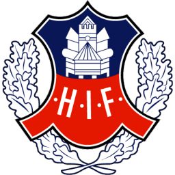
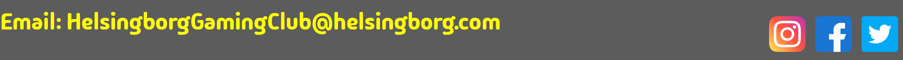

# Helsingborg's Gaming Club

Helsingborg's Gaming Club or HGC for short is a club that plays Competetive video games together and looks too take there skills across the nordic region and beyond.
The site targets gamers who live around helsingborg, HGC's website is a simple but helpful website that gets the user what they need with minimal fuss.

# Wireframes

The wireframes for HGC were created in Balsamiq. it covers both mobile and desktop sites. The final site is changed quite a lot on mobile and slightly on desktop from the wireframes due to changes in design that looked better and unfixable bugs.

# Site Structure

HGC has only one page, the design choice for this was because all the infomation that users would want would easily be able too fit on one page without any clutter. For this one page there are 3 main sections all with relevent infomation the user would want when going too this website.

# Design Choices
`###` typography    

For the main Heading i chose 'Bebas Neue' a Clear and concise font making sure too prioritise readability as much as possible. For the rest of the page i used 'Madimi One' a much more playful font i wanted too give readers the impression that although its a competitive enviroment everyone is welcome and it fun place too be.

`###` Colour Scheme

The colours i used for the Project are based off of the Skåne Flag and the Helsingborg Football club Helsingborg IF.

 

# Features

HGC's site is set up easy too use, quick too navigate and simple too get in touch. It has many features that the user can use too do such things as a navigation bar and a simple contact form.

## Existing features
 
### Header and Navigation bar

At the top of all the pages in the site the nav bar, it is fully responsive and contains links to all the sections of the site to enable ease of navigation in one simple location.
The Header isnt clickable as i decided too make only one page and that seemed pointless however if i were too make more pages the header would of been a link.

### What we play and do section

This section lets the users know what we are playing and the culture of what the club is. 
the photo shows the ambiance of what goes on at the club.
At the bottom of the blurb there is a link too the contact part of the page for users too access the form if interested.

### Where and When section

The where and when section gives users the address of the club and the dates and times of meetings.
There is also a embbed google map of the location for users too use for potential parking or bus routes.

### Contact Us section

The Contact section shows a simple form with name, email and message for users too get in contact with the club.
This should complete the journy of the user if they are interested in the club.
The photo used shows of a summer day of helsingborg.

### Footer

In the footer we see 3 icons for social media links if the user wishes too learn more about what the club is doing.
It also has an email address incase the user wants too email us from their own email.

